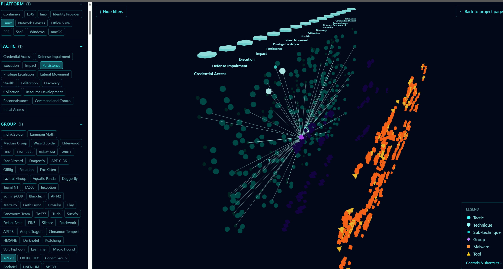

# MITRE ATT&CK 3D Explorer

An interactive 3D explorer of the [MITRE ATT&CK](https://attack.mitre.org/)
Enterprise framework. Tactics arc across the top, technique clouds hang below
each one, sub-techniques sit behind their parents, and threat groups and
software float in back-planes with arcs to the techniques they touch. Search
and multi-dimensional filtering make intersections obvious.

**Live:** https://attack.kirkabbott.com



## What it is

The ATT&CK matrix is normally a 2D grid. This explorer treats the full corpus
as a 3D graph so the relationships between techniques, the groups that use
them, and the software that implements them are visible at once. Stack filters
to answer questions like "persistence techniques on Linux that APT29 has used
and Lazarus has not."

## How it works

- **Data pipeline** — `scripts/fetch-attack-data.ts` pulls the MITRE ATT&CK
  STIX bundle and flattens it into a compact graph (`public/data/`). A monthly
  GitHub Action refreshes it.
- **Layout** — `src/lib/attack/layout.ts` assigns every node a 3D position.
- **Rendering** — React Three Fiber renders the scene; nodes are instanced
  meshes for performance.
- **State** — filter and focus state is React context, encoded to the URL
  query string so any view is shareable.

## Tech stack

React, TypeScript, Three.js / React Three Fiber, Vite, Tailwind CSS.

## Local development

```bash
npm install
npm run fetch-attack-data   # regenerates public/data/*.json (also committed)
npm run dev
```

`npm run build` produces a static site in `dist/`. `npm test` runs the suite.

## License

MIT — see [LICENSE](LICENSE).
